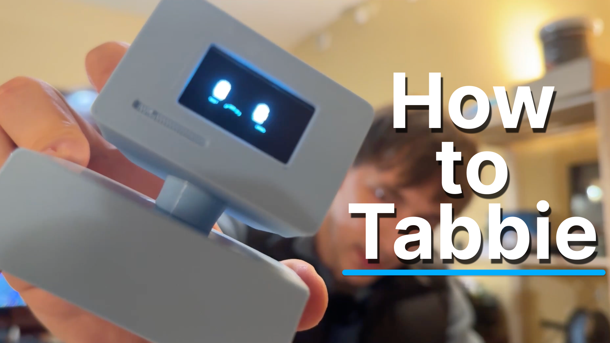

# Getting Started with Tabbie

A mini Twitch streamer on your desk, cheering you on, but also keeping you focused. Lets make one


---

## What You'll Need

### The Parts (~$18 USD / ~€16 EUR total)
- **ESP32** (the robot's brain)
- **1.3" OLED Screen** (the face)
- **3D Printed Parts** (the body)
- **Jumper Wires** (connecting everything)

I recommend buying the parts on **Amazon or Aliexpress**  
**Amazon** is safe choice and fast shipping, but will be more expensive  
**Aliexpress** is cheaper, but things sometimes arrive broken and shipping takes long  

**Amazon EU:**
- [ESP32 USB-C](https://amzn.to/4mDWJ6Z) (~14 EUR) 
- [OLED Screen - Pack of 3](https://amzn.to/4nxXHCO) (~18.99 EUR)
- [JumperWires -  Full pack](https://amzn.to/4mOGZ0I) (~6.40 EUR)
- [PLA Filament for 3D printing](https://amzn.to/46QfHkC) (~14 EUR)

**Amazon US**
- [ESP32 USB-C](https://amzn.to/4mGymW4) (~13.99 USD)
- [OLED Screen](https://amzn.to/4nGTbSQ) (~17.99 USD)
- [JumperWires -  Full pack](https://amzn.to/4nFxh2a) (~6.80 USD)
- [PLA Filament for 3D printing](https://amzn.to/46yAlqL) (~13.99 USD)

**Aliexpress Worldwide:**
- [ESP32 USB-C](https://s.click.aliexpress.com/e/_c3wydxSb) (~6.99 USD / 5.20 EUR a piece)
- [1.3 INCH OLED Screen white](https://s.click.aliexpress.com/e/_c30oI6Nd) (~5.35 USD / 4.50 EUR)
- [JumperWires](https://s.click.aliexpress.com/e/_c3SbwD0R) (~3.30 USD / 2.59 EUR)
- [PLA Filament for 3D printing](https://s.click.aliexpress.com/e/_c3O5ECAR) (~15.50 USD / 13.50 EUR)


*These are affiliate links - I get 3% at no extra cost to you!*

## **Don't want to deal with parts & printing?** [Just buy a finished one here](https://www.tabbie.me)

<div align="center">

### **START. How to Build Tabbie**
**The video below covers everything for both Windows and Mac users.**

</div>


[](https://youtu.be/l_Xwujika5U)


---

### STEP 1: Install & Download 


>Install:
1. **Node.js** (v18 or newer) - [Download](https://nodejs.org/) - Runs the dashboard web app
2. **Visual Studio Code** - [Download](https://code.visualstudio.com/) - Editor to view and modify code
3. **PlatformIO** (for programming the ESP32) - [Download](https://platformio.org/) - Uploads firmware to ESP32
4. **Git** - [Download Git](https://git-scm.com/)  To download via command line using `git clone`  

On macOS, the command-line setup is:

```bash
brew install platformio mosquitto
```

If the ESP32 serial port does not show up under `/dev/cu.*`, install the CP210x
USB driver:

```bash
brew install --cask silicon-labs-vcp-driver
```


>Download:

**Option A: Using Git**   

```bash
git clone https://github.com/mdavydau/bobik.git
cd bobik
```

**Option B: Download as ZIP**

- Go to https://github.com/Peeeeteer/tabbie
- Click the green “Code” button
- Select “Download ZIP”
- Extract it somewhere easy to find

*[Image here showing how to download ZIP]*


### STEP 2: Print the Body/Enclosure   

1. Use the STL files from the `/hardware` folder & print
      - `hardware/GCODE.bgcode`
      - `hardware/STL/antenna.stl`
      - `hardware/STL/antenna2.stl`
      - `hardware/STL/bottom_case.stl`
      - `hardware/STL/case.stl`
      - `hardware/STL/neck.stl`
      - `hardware/STL/panel.stl`
      - `hardware/STL/top_case.stl`

**Tip:** Turn on supports for `neck.stl` and `top_case.stl` 


### STEP 3: Install ESP32 Drivers

Your ESP32 (brains) needs special drivers to talk to your computer.

**Windows Users:**
1. Download drivers from [Silicon Labs](https://www.silabs.com/software-and-tools/usb-to-uart-bridge-vcp-drivers?tab=downloads)
2. Install them
3. Plug in your ESP32 with a USB cable
4. Open Device Manager - you should see "Silicon Labs CP210x USB to UART Bridge"

**Mac/Linux Users:**
- Usually works automatically when you plug it in
- If it doesn't work, type this in Terminal: `brew install --cask silicon-labs-vcp-driver`

---

### STEP 4: Connect the Parts

**Wiring Guide:**
1. Partly Asemble Enclosure (as per video)
2. Connect the OLED screen to ESP32:
   - SDA wire → GPIO 21 (D21)
   - SCK/SCL wire → GPIO 22 (D22)
   - VDD → 3.3V 
   - GND → GND (Ground)

Keep it partly assembled (we need to upload code and make sure everything works first)

GG. done


---

### STEP 5: Program Your ESP32

1. **Navigate to the firmware folder:**

```bash
cd firmware
```

2. **Optional: enable MQTT remote control**

If you want Bobik to connect to a remote MQTT broker, create a local config:

```bash
cp src/mqtt_config.example.h src/mqtt_config.h
$EDITOR src/mqtt_config.h
```

Fill in `MQTT_HOST`, `MQTT_PORT`, `MQTT_USER`, and `MQTT_PASS`.
`src/mqtt_config.h` is ignored by git so credentials do not get committed.
See [`MQTT_BRIDGE.md`](MQTT_BRIDGE.md) for the full MQTT setup.

3. **Upload the code to your ESP32:**

The first clean build can take a few minutes because U8g2 and animation assets
are compiled. Later builds should be much faster.

```bash
pio run --target upload
```

**Tip:** If upload fails, hold down the BOOT button on your ESP32 while uploading
and make sure that your are in still in the `firmware` directory when uploading 

4. **Configure WiFi**

The current firmware stores WiFi credentials on the ESP32 itself. On a new board
or after reset, connect your computer/phone to the `Tabbie-Setup` WiFi network
and follow the setup page to save your WiFi. If the board was already configured,
normal uploads do not erase those saved WiFi settings.

5. Finish assembling Tabbie.

Put the screen in the front -> front in the head

---


### STEP 6: Set Up the React Dashboard

Open your terminal/command and run:

```bash
# Go to the dashboard folder
cd app

# Install everything it needs
npm install

# Start it up
npm run dev
```

The dashboard will open at `http://localhost:8080` in your web browser.

---

### STEP 7: Connect Everything Together

1. **Open the dashboard** at `http://localhost:8080` in your browser
2. Follow the onboarding steps
3. **Watch the magic!** Tabbie should start showing its idle animation

**Tip:** Sometimes things just break, so disconnect tabbie for a few seconds and plug back in if wifi is not connecting properly. 

---

### Let's Use Tabbie!

**Create Tasks**
- Go to the Tasks tab
- Add things you need to do
- Start pomodors for tasks
- Tick it of when finished

Tabbie will show focus, happy,relax and bored animations a long the way to keep you focused.


**Important:**  
All your tasks/notes etc... are only saved on your computer, no one can access them.

---

## Troubleshooting

### ESP32 Won't Connect
- Double-check your WiFi name and password in the `.env` file and press "save"
- Make sure your ESP32 and computer are on the same WiFi network

### Dashboard Won't Start
- Make sure you ran `npm install` in the `dashboard` folder
- Check that you have Node.js v18 or newer (type `node --version` to check)
- Try running `npm run dev` again from the `dashboard` folder

### Can't Upload Code to ESP32
- Install the CP2102 drivers (see Step 3)
- Hold the BOOT button on ESP32 while uploading
- Check your USB cable (some cables only charge, they don't transfer data)

**Need more help?** Join the community:
- [Discord](https://discord.gg/7er2Ysjc) - [Reddit](https://www.reddit.com/r/deskrobot/) - [YouTube](https://www.youtube.com/@LloydDecember1) - [GitHub](https://github.com/Peeeeteer/tabbie) - [X](https://x.com/lloyd_december)

---

## That's It!

If this helped you, consider giving the project a star on [GitHub](https://github.com/Peeeeteer/tabbie)!

Happy building!
